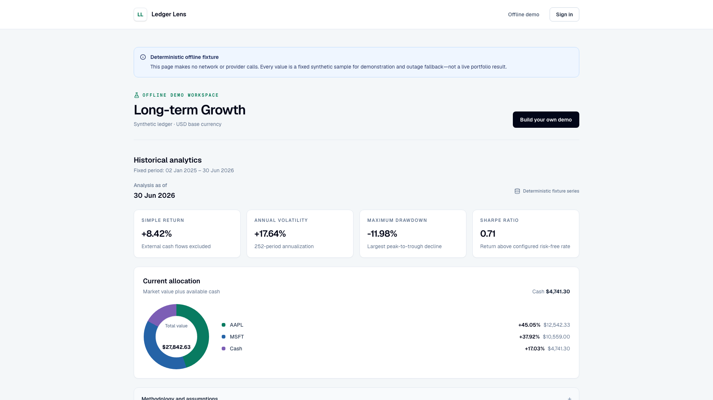

# Ledger Lens

[](https://github.com/RujingXu-bit/Ledger-Lens-web/actions/workflows/ci.yml)
[](https://github.com/RujingXu-bit/Ledger-Lens-web/releases/tag/v1.0.0)
[](https://portfolio-analytics-web-hazel.vercel.app)
[](https://github.com/RujingXu-bit/Ledger-Lens-api)

[Live Demo](https://portfolio-analytics-web-hazel.vercel.app) ·
[Offline Fixture](https://portfolio-analytics-web-hazel.vercel.app/demo) ·
[Three-Minute Video](https://github.com/RujingXu-bit/Ledger-Lens-api/releases/download/v1.1.0/portfolio-analytics-demo.mp4) ·
[Backend Release](https://github.com/RujingXu-bit/Ledger-Lens-api/releases/tag/v1.2.0) ·
[Interview Guide](https://github.com/RujingXu-bit/Ledger-Lens-api/blob/main/docs/interview-guide.md)



Independent Next.js dashboard for the
[Ledger Lens API v1.2.0](https://github.com/RujingXu-bit/Ledger-Lens-api/releases/tag/v1.2.0).
It turns an owner-scoped transaction ledger into explainable historical metrics
and bounded risk summaries without implying live trading, forecasts, or
investment advice.

## Product flow

- English landing page with architecture, scope, and project-source links.
- `/demo` is a deterministic offline fixture that never calls FastAPI or a market
  data provider; every sample value is explicitly labelled synthetic.
- Registration automatically establishes an HttpOnly BFF session; login and
  logout never expose the FastAPI token to browser JavaScript.
- Portfolio list and creation, followed by conditional DEPOSIT, WITHDRAWAL, BUY,
  and SELL entry with stable idempotency references.
- Preview-first CSV transaction import with a downloadable template, row-level
  validation, partial-failure reporting, and idempotent replay status.
- Explicit date-range analytics with simple return, annualized volatility,
  maximum drawdown, Sharpe ratio, asset allocation, `as_of`, stale provenance,
  and full methodology.
- User-triggered risk summaries with generator/model provenance, limitations,
  disclaimer, and newest-first snapshot history.

V1 intentionally excludes edit/delete, refresh tokens, multiple currencies,
real-time quotes, prediction, automated trading, and account administration.

## Security boundary

- The browser calls only same-origin Next.js Route Handlers.
- The short-lived access token remains in an HttpOnly, production-enforced
  Secure, SameSite=Lax cookie.
- BFF routes proxy only a strict auth/Portfolio allowlist and never accept an
  arbitrary upstream URL.
- Writes require the exact configured `Origin`; private responses are
  `no-store`; upstream 401 responses expire the cookie and redirect to login.
- Static and browser tests verify that the JWT is absent from pages, responses,
  client logs, Local Storage, Session Storage, and `document.cookie`.
- FastAPI CORS remains disabled because the browser never calls it directly.

## Local setup

Install Node.js 24 and pnpm 11.9.0. Run the backend v1.2.0 separately, then:

```bash
cp .env.example .env.local
pnpm install --frozen-lockfile
pnpm dev
```

For local plain HTTP only, `.env.example` sets `SESSION_COOKIE_SECURE=false`.
Production ignores that escape hatch and always emits `Secure` cookies.

## Quality gates

```bash
pnpm check
pnpm build
pnpm exec playwright install chromium
pnpm test:e2e
pnpm audit
```

Vitest/Testing Library cover formatting, forms, error mapping, provenance, and
the token boundary. Playwright completes registration through saved history via
the BFF, proves the token remains HttpOnly, exercises keyboard entry, and checks
375px, 768px, and 1440px layouts. Its in-process fake backend exists only under
`tests/e2e` and is not part of the product bundle.

## Pinned API contract

`openapi/portfolio-analytics-api-v1.2.0.json` is a fixed snapshot from the
published backend. `openapi-typescript` generates `src/lib/api/schema.d.ts`, and
CI fails if regeneration differs:

```bash
pnpm api:types:generate
pnpm api:types:check
```

See [docs/architecture.md](docs/architecture.md) for the trust boundary and
route policy, [docs/deployment.md](docs/deployment.md) for the Vercel/Render/
Neon/Upstash production runbook, and [CHANGELOG.md](CHANGELOG.md) for release
scope.
